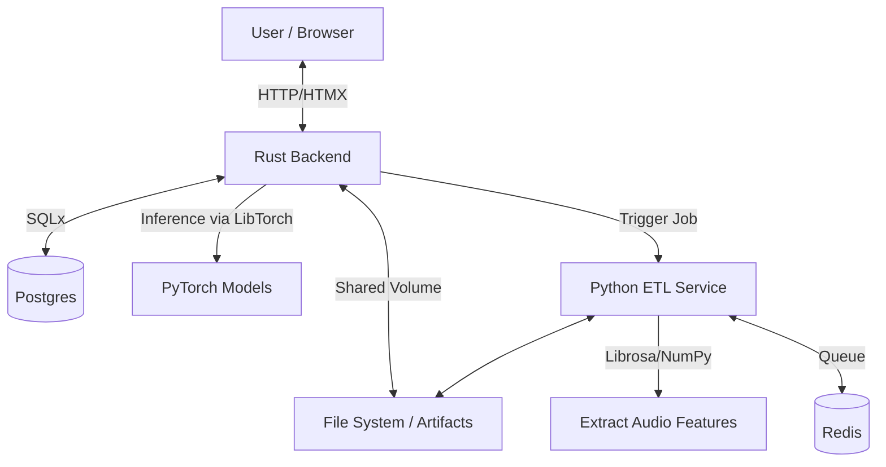

# 🦀 Chrust (Torch + Rust)

> **A high-performance, hybrid audio classification platform integrating modern Rust web services with specialized Python ETL pipelines and LibTorch inference.**


---

## 🚀 Overview

**Chrust** is a proof-of-concept application enabling complex audio analysis and music genre classification. It demonstrates a powerful microservices architecture that leverages **Rust's** speed and safety for the web layer and inference engine, while utilizing **Python's** rich ecosystem for signal processing.

The core innovation is running **PyTorch models directly within Rust** using `tch-rs` (LibTorch bindings), serving predictions via an **Axum** web server, and using a dedicated Python **FastAPI** service for feature extraction (ETL).

## 🏗 Architecture

The system is composed of two primary containerized services orchestrated via Docker Compose:



### 1. Backend Service (Rust)
The application core. It handles HTTP requests, serves the UI, manages state, and executes the ML inference.
*   **Framework:** `Axum` (High-performance async web framework)
*   **ML Engine:** `tch` (LibTorch bindings) for running PyTorch models in native code.
*   **Database:** `SQLx` (Compile-time checked SQL) with PostgreSQL.
*   **Frontend:** Server-side rendering with `Askama` templates + `HTMX` for interactivity.

### 2. Data Service (Python)
A specialized ETL worker that processes raw audio.
*   **Framework:** `FastAPI` + `Redis` (for job management/caching).
*   **Audio Processing:** `Librosa` & `NumPy`.
*   **Role:** Extracts complex features (MFCCs, Chroma, Spectrograms) and saves them as `.npy` artifacts for the Rust backend to consume.

---

## ⚡ Key Features

*   **Hybrid ML Pipeline:** Decouples heavy data processing (Python) from high-speed serving and inference (Rust).
*   **Native Torch Inference:** Runs `.pt` models in Rust without a Python runtime dependency in the backend, significantly reducing inference latency.
*   **Complex Audio Analysis:** Extracts and classifies based on multiple features:
    *   Mel Frequency Cepstral Coefficients (MFCC)
    *   Chroma (CENS, CQT, STFT)
    *   Spectrograms (Power, Mel)
    *   Tonnetz & Fourier Transforms
*   **Modern Web Stack:** Uses **HTMX** for a smooth, SPA-like feel without the complexity of a heavy JavaScript framework.
*   **Robust Data Layer:** Fully containerized PostgreSQL and Redis instance for persistence and caching.

---

## 🛠 Tech Stack

### Web & Systems (The "Chrust")
*    **Language**
*    **Web Framework**
*    **Inference Engine**
*    **Frontend Interactivity**
*    **ORM / Query Builder**

### Data Engineering (The "Etl")
*    **DS Language**
*    **API Wrapper**
*    **Audio Analysis**
*    **Numerical Comp**

---

## 🏁 Getting Started

### Prerequisites
*   Docker & Docker Compose

### Installation & Run

1.  **Clone the repository**
    ```bash
    git clone https://github.com/rafal-draws/chrust.git
    cd chrust
    ```

2.  **Start the Cluster**
    This pulls the heavy images (Rust, Postgres, Python w/ dependencies) and sets up the network.
    ```bash
    docker compose up --build
    ```
    *Note: The Rust container will download specific LibTorch binaries on first build via `libtorch_setup.sh`. This might take a few minutes.*

3.  **Access the Application**
    Open your browser to:
    ```
    http://localhost:3000
    ```

### Usage Flow
1.  **Register:** Create a quick anonymous session/user.
2.  **Upload:** Submit an audio file (MP3/WAV) via the dashboard.
3.  **Process:** The system automatically pipelines the file to the Python service for feature extraction.
4.  **Classify:** View the specific classification breakdown (Rock, Pop, Electronic, etc.) based on the extracted audio features.

---

## 💡 Why "Chrust"?

The boundary between research (Python) and production (Rust/C++) is blurring. **Chrust** exemplifies the pattern of keeping the training and experimentation in Python (where the libraries are richest) but moving the production inference to Rust for:
1.  **Memory Safety:** Avoiding segfaults in complex C++ bindings.
2.  **Performance:** No Global Interpreter Lock (GIL) contention during web request handling.
3.  **Predictability:** Static typing ensures the data shapes passing through the system are correct at compile time.

Also, its a regional sweet treat from where I'm from.

---

## 📜 License

Distributed under the MIT License. See `LICENSE` for more information.
